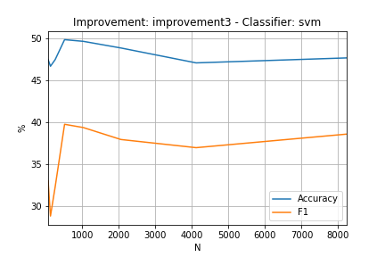

# Ejercicio 1

## Estadísticas InterTASS

Total Tweets: 1008

### Polarity Counts

| NEU | N | NONE | P |
| --- | - | ---- | - |
| 133 | 418 | 139 | 318 |

## Estadísticas GeneralTASS

Total Tweets: 7219

### Polarity Counts

| NEU | N+ | P+ | N | NONE | P |
| --- | -- | -- | - | ---- | - |
| 670 | 847 | 1652 | 1335 | 1483 | 1232 |

# Ejercicio 2

Para este ejercicio se eligieron las siguientes 4 mejoras para el clasificador:

###### Improvement 1: Binarización de Conteos

Consiste básicamente en no contar repeticiones. Es decir, cada palabra aparece o no aparece, sin importar la cantidad de veces que lo hace.

###### Improvement 2: Mejor Tokenizer

Para esta mejora se utilizó el TweetTokenizer de nltk. El mismo contempla emojis y signos de puntuación, los cuales pueden ser de gran importancia para el análisis de sentimiento.

###### Improvement 3: Filtrado de stopwords

En esta mejora se utilizó el listado de stop words de nltk para que no sean contempladas.

###### Improvement 4: Manejo de Negaciones

En cuanto al manejo de negaciones, la idea consistió en que cada vez que aparecía una palabra 'no' o 'tampoco', se procedía a modificar las siguientes palabras agregandoles el prefijo 'NOT_'. En particular se decidió agregar dicho prefijo a los siguientes 5 tokens o hasta encontrar un punto.

A continuación se muestran los resultados obtenidos, tanto para el CountVectorizer por defecto, como para cada una de las 4 mejoras:

## DEFAULT
### MAXENT
##### Eval
| Sentiment | Precision | Recall | F1 |
| --------- | --------- | ------ | -- |
| P | 52.89% (119/225) | 76.28% (119/156) | 62.47% |
| N | 60.65% (131/216) | 59.82% (131/219) | 60.23% |
| NEU | 15.79% (3/19) | 4.35% (3/69) | 6.82% |
| NONE | 28.26% (13/46) | 20.97% (13/62) | 24.07% |

| Accuracy | Macro-Precision | Macro-Recall | Macro-F1 |
| -------- | --------------- | ------------ | -------- |
| 52.57% (266/506) | 39.40% | 40.35% | 39.87% |

|  | P | N | NEU | NONE |
| ---- | ---- | ---- | ---- |
| P  | 119  | 27  | 5  | 5 |
| N  | 60  | 131  | 7  | 21 |
| NEU  | 30  | 29  | 3  | 7 |
| NONE  | 16  | 29  | 4  | 13 |

##### Curve

### MNB
##### Eval
| Sentiment | Precision | Recall | F1 |
| --------- | --------- | ------ | -- |
| P | 49.22% (127/258) | 81.41% (127/156) | 61.35% |
| N | 58.61% (143/244) | 65.30% (143/219) | 61.77% |
| NEU | 0.00% (0/1) | 0.00% (0/69) | 0.00% |
| NONE | 66.67% (2/3) | 3.23% (2/62) | 6.15% |

| Accuracy | Macro-Precision | Macro-Recall | Macro-F1 |
| -------- | --------------- | ------------ | -------- |
| 53.75% (272/506) | 43.62% | 37.48% | 40.32% |

|  | P | N | NEU | NONE |
| ---- | ---- | ---- | ---- |
| P  | 127  | 28  | 1  | 0 |
| N  | 75  | 143  | 0  | 1 |
| NEU  | 35  | 34  | 0  | 0 |
| NONE  | 21  | 39  | 0  | 2 |

##### Curve

### SVM
##### Eval
| Sentiment | Precision | Recall | F1 |
| --------- | --------- | ------ | -- |
| P | 54.74% (104/190) | 66.67% (104/156) | 60.12% |
| N | 62.69% (126/201) | 57.53% (126/219) | 60.00% |
| NEU | 13.89% (5/36) | 7.25% (5/69) | 9.52% |
| NONE | 25.32% (20/79) | 32.26% (20/62) | 28.37% |

| Accuracy | Macro-Precision | Macro-Recall | Macro-F1 |
| -------- | --------------- | ------------ | -------- |
| 50.40% (255/506) | 39.16% | 40.93% | 40.02% |

|  | P | N | NEU | NONE |
| ---- | ---- | ---- | ---- |
| P  | 104  | 24  | 11  | 17 |
| N  | 48  | 126  | 15  | 30 |
| NEU  | 26  | 26  | 5  | 12 |
| NONE  | 12  | 25  | 5  | 20 |

##### Curve

## IMPROVEMENT1
### MAXENT
##### Eval
| Sentiment | Precision | Recall | F1 |
| --------- | --------- | ------ | -- |
| P | 51.98% (118/227) | 75.64% (118/156) | 61.62% |
| N | 58.88% (126/214) | 57.53% (126/219) | 58.20% |
| NEU | 12.50% (2/16) | 2.90% (2/69) | 4.71% |
| NONE | 26.53% (13/49) | 20.97% (13/62) | 23.42% |

| Accuracy | Macro-Precision | Macro-Recall | Macro-F1 |
| -------- | --------------- | ------------ | -------- |
| 51.19% (259/506) | 37.47% | 39.26% | 38.35% |

|  | P | N | NEU | NONE |
| ---- | ---- | ---- | ---- |
| P  | 118  | 28  | 4  | 6 |
| N  | 65  | 126  | 6  | 22 |
| NEU  | 29  | 30  | 2  | 8 |
| NONE  | 15  | 30  | 4  | 13 |

##### Curve

### MNB
##### Eval
| Sentiment | Precision | Recall | F1 |
| --------- | --------- | ------ | -- |
| P | 48.11% (127/264) | 81.41% (127/156) | 60.48% |
| N | 59.17% (142/240) | 64.84% (142/219) | 61.87% |
| NEU | 100.00% (0/0) | 0.00% (0/69) | 0.00% |
| NONE | 50.00% (1/2) | 1.61% (1/62) | 3.12% |

| Accuracy | Macro-Precision | Macro-Recall | Macro-F1 |
| -------- | --------------- | ------------ | -------- |
| 53.36% (270/506) | 64.32% | 36.97% | 46.95% |

|  | P | N | NEU | NONE |
| ---- | ---- | ---- | ---- |
| P  | 127  | 29  | 0  | 0 |
| N  | 76  | 142  | 0  | 1 |
| NEU  | 37  | 32  | 0  | 0 |
| NONE  | 24  | 37  | 0  | 1 |

##### Curve

### SVM
##### Eval
| Sentiment | Precision | Recall | F1 |
| --------- | --------- | ------ | -- |
| P | 54.55% (108/198) | 69.23% (108/156) | 61.02% |
| N | 63.21% (122/193) | 55.71% (122/219) | 59.22% |
| NEU | 15.79% (6/38) | 8.70% (6/69) | 11.21% |
| NONE | 24.68% (19/77) | 30.65% (19/62) | 27.34% |

| Accuracy | Macro-Precision | Macro-Recall | Macro-F1 |
| -------- | --------------- | ------------ | -------- |
| 50.40% (255/506) | 39.56% | 41.07% | 40.30% |

|  | P | N | NEU | NONE |
| ---- | ---- | ---- | ---- |
| P  | 108  | 23  | 10  | 15 |
| N  | 52  | 122  | 15  | 30 |
| NEU  | 29  | 21  | 6  | 13 |
| NONE  | 9  | 27  | 7  | 19 |

##### Curve

## IMPROVEMENT2
### MAXENT
##### Eval
| Sentiment | Precision | Recall | F1 |
| --------- | --------- | ------ | -- |
| P | 53.30% (105/197) | 67.31% (105/156) | 59.49% |
| N | 62.04% (134/216) | 61.19% (134/219) | 61.61% |
| NEU | 29.41% (5/17) | 7.25% (5/69) | 11.63% |
| NONE | 21.05% (16/76) | 25.81% (16/62) | 23.19% |

| Accuracy | Macro-Precision | Macro-Recall | Macro-F1 |
| -------- | --------------- | ------------ | -------- |
| 51.38% (260/506) | 41.45% | 40.39% | 40.91% |

|  | P | N | NEU | NONE |
| ---- | ---- | ---- | ---- |
| P  | 105  | 26  | 7  | 18 |
| N  | 53  | 134  | 3  | 29 |
| NEU  | 24  | 27  | 5  | 13 |
| NONE  | 15  | 29  | 2  | 16 |

##### Curve

### MNB
##### Eval
| Sentiment | Precision | Recall | F1 |
| --------- | --------- | ------ | -- |
| P | 51.61% (128/248) | 82.05% (128/156) | 63.37% |
| N | 58.20% (149/256) | 68.04% (149/219) | 62.74% |
| NEU | 100.00% (0/0) | 0.00% (0/69) | 0.00% |
| NONE | 100.00% (2/2) | 3.23% (2/62) | 6.25% |

| Accuracy | Macro-Precision | Macro-Recall | Macro-F1 |
| -------- | --------------- | ------------ | -------- |
| 55.14% (279/506) | 77.45% | 38.33% | 51.28% |

|  | P | N | NEU | NONE |
| ---- | ---- | ---- | ---- |
| P  | 128  | 28  | 0  | 0 |
| N  | 70  | 149  | 0  | 0 |
| NEU  | 28  | 41  | 0  | 0 |
| NONE  | 22  | 38  | 0  | 2 |

##### Curve

### SVM
##### Eval
| Sentiment | Precision | Recall | F1 |
| --------- | --------- | ------ | -- |
| P | 54.89% (101/184) | 64.74% (101/156) | 59.41% |
| N | 63.27% (124/196) | 56.62% (124/219) | 59.76% |
| NEU | 13.95% (6/43) | 8.70% (6/69) | 10.71% |
| NONE | 22.89% (19/83) | 30.65% (19/62) | 26.21% |

| Accuracy | Macro-Precision | Macro-Recall | Macro-F1 |
| -------- | --------------- | ------------ | -------- |
| 49.41% (250/506) | 38.75% | 40.18% | 39.45% |

|  | P | N | NEU | NONE |
| ---- | ---- | ---- | ---- |
| P  | 101  | 26  | 12  | 17 |
| N  | 45  | 124  | 17  | 33 |
| NEU  | 25  | 24  | 6  | 14 |
| NONE  | 13  | 22  | 8  | 19 |

##### Curve

## IMPROVEMENT3
### MAXENT
##### Eval
| Sentiment | Precision | Recall | F1 |
| --------- | --------- | ------ | -- |
| P | 48.71% (113/232) | 72.44% (113/156) | 58.25% |
| N | 61.84% (128/207) | 58.45% (128/219) | 60.09% |
| NEU | 21.43% (3/14) | 4.35% (3/69) | 7.23% |
| NONE | 30.19% (16/53) | 25.81% (16/62) | 27.83% |

| Accuracy | Macro-Precision | Macro-Recall | Macro-F1 |
| -------- | --------------- | ------------ | -------- |
| 51.38% (260/506) | 40.54% | 40.26% | 40.40% |

|  | P | N | NEU | NONE |
| ---- | ---- | ---- | ---- |
| P  | 113  | 29  | 2  | 12 |
| N  | 66  | 128  | 6  | 19 |
| NEU  | 31  | 29  | 3  | 6 |
| NONE  | 22  | 21  | 3  | 16 |

##### Curve

### MNB
##### Eval
| Sentiment | Precision | Recall | F1 |
| --------- | --------- | ------ | -- |
| P | 43.88% (129/294) | 82.69% (129/156) | 57.33% |
| N | 60.71% (119/196) | 54.34% (119/219) | 57.35% |
| NEU | 20.00% (1/5) | 1.45% (1/69) | 2.70% |
| NONE | 54.55% (6/11) | 9.68% (6/62) | 16.44% |

| Accuracy | Macro-Precision | Macro-Recall | Macro-F1 |
| -------- | --------------- | ------------ | -------- |
| 50.40% (255/506) | 44.78% | 37.04% | 40.55% |

|  | P | N | NEU | NONE |
| ---- | ---- | ---- | ---- |
| P  | 129  | 24  | 1  | 2 |
| N  | 97  | 119  | 2  | 1 |
| NEU  | 41  | 25  | 1  | 2 |
| NONE  | 27  | 28  | 1  | 6 |

##### Curve

### SVM
##### Eval
| Sentiment | Precision | Recall | F1 |
| --------- | --------- | ------ | -- |
| P | 50.50% (101/200) | 64.74% (101/156) | 56.74% |
| N | 61.83% (115/186) | 52.51% (115/219) | 56.79% |
| NEU | 17.65% (6/34) | 8.70% (6/69) | 11.65% |
| NONE | 22.09% (19/86) | 30.65% (19/62) | 25.68% |

| Accuracy | Macro-Precision | Macro-Recall | Macro-F1 |
| -------- | --------------- | ------------ | -------- |
| 47.63% (241/506) | 38.02% | 39.15% | 38.57% |

|  | P | N | NEU | NONE |
| ---- | ---- | ---- | ---- |
| P  | 101  | 28  | 6  | 21 |
| N  | 56  | 115  | 16  | 32 |
| NEU  | 26  | 23  | 6  | 14 |
| NONE  | 17  | 20  | 6  | 19 |

##### Curve

## IMPROVEMENT4
### MAXENT
##### Eval
| Sentiment | Precision | Recall | F1 |
| --------- | --------- | ------ | -- |
| P | 42.26% (101/239) | 64.74% (101/156) | 51.14% |
| N | 56.61% (107/189) | 48.86% (107/219) | 52.45% |
| NEU | 100.00% (0/0) | 0.00% (0/69) | 0.00% |
| NONE | 19.23% (15/78) | 24.19% (15/62) | 21.43% |

| Accuracy | Macro-Precision | Macro-Recall | Macro-F1 |
| -------- | --------------- | ------------ | -------- |
| 44.07% (223/506) | 54.53% | 34.45% | 42.22% |

|  | P | N | NEU | NONE |
| ---- | ---- | ---- | ---- |
| P  | 101  | 40  | 0  | 15 |
| N  | 76  | 107  | 0  | 36 |
| NEU  | 36  | 21  | 0  | 12 |
| NONE  | 26  | 21  | 0  | 15 |

##### Curve

### MNB
##### Eval
| Sentiment | Precision | Recall | F1 |
| --------- | --------- | ------ | -- |
| P | 36.69% (113/308) | 72.44% (113/156) | 48.71% |
| N | 55.62% (94/169) | 42.92% (94/219) | 48.45% |
| NEU | 0.00% (0/4) | 0.00% (0/69) | 0.00% |
| NONE | 24.00% (6/25) | 9.68% (6/62) | 13.79% |

| Accuracy | Macro-Precision | Macro-Recall | Macro-F1 |
| -------- | --------------- | ------------ | -------- |
| 42.09% (213/506) | 29.08% | 31.26% | 30.13% |

|  | P | N | NEU | NONE |
| ---- | ---- | ---- | ---- |
| P  | 113  | 32  | 1  | 10 |
| N  | 114  | 94  | 2  | 9 |
| NEU  | 46  | 23  | 0  | 0 |
| NONE  | 35  | 20  | 1  | 6 |

##### Curve

### SVM
##### Eval
| Sentiment | Precision | Recall | F1 |
| --------- | --------- | ------ | -- |
| P | 41.44% (92/222) | 58.97% (92/156) | 48.68% |
| N | 55.33% (83/150) | 37.90% (83/219) | 44.99% |
| NEU | 100.00% (0/0) | 0.00% (0/69) | 0.00% |
| NONE | 15.67% (21/134) | 33.87% (21/62) | 21.43% |

| Accuracy | Macro-Precision | Macro-Recall | Macro-F1 |
| -------- | --------------- | ------------ | -------- |
| 38.74% (196/506) | 53.11% | 32.69% | 40.47% |

|  | P | N | NEU | NONE |
| ---- | ---- | ---- | ---- |
| P  | 92  | 31  | 0  | 33 |
| N  | 78  | 83  | 0  | 58 |
| NEU  | 29  | 18  | 0  | 22 |
| NONE  | 23  | 18  | 0  | 21 |

##### Curve

# Ejercicio 2b

Para este ejercicio se tomó la mejora que tokeniza contemplando emojis y signos de puntuación.

A continuación se muestran, para cada etiqueta, qué tokens influyeron más para cada una de ellas, tanto a favor como en contra.

N:
	portada ;-) enhorabuena besos buena ([-1.79455119 -1.79385749 -1.32522904 -1.32330086 -1.31996872])
	denuncia odio recortes muertos triste ([1.61085566 1.67503365 1.73063649 2.00134694 2.35689936])

NEU:
	parados cree portada toda cont ([-1.07308983 -1.04328449 -0.99198165 -0.98635968 -0.94534415])
	expectación decidirán huelga @palomacervilla broma ([1.26534759 1.29802823 1.32196835 1.32926172 1.40175607])

NONE:
	;-) feliz gracias gran mal ([-2.3014078  -1.89779197 -1.78641882 -1.74520424 -1.61971695])
	periódico jugar @juandevi reunión portada ([1.25258114 1.33123844 1.35833665 1.45095676 2.25098602])

P:
	culpa triste portada urdangarin odio ([-1.46644099 -1.41013482 -1.37790014 -1.28119956 -1.20576253])
	felicidades gracias homenaje enhorabuena ;-) ([1.90229751 1.9487667  2.04844774 2.31960857 2.37838754])

Luego se eligió un tweet con id 402,

'Ahora que empiezan las jornadas de toros en esta ciudad me pongo un poco más triste al ver que seguimos sin evolucionar en muchas cosas'

y para este se analizó el peso de cada token para cada etiqueta:

CLASES: 
['N' 'NEU' 'NONE' 'P']

ahora [-0.20066646 -0.03454963  0.26203698  0.04468842]
al [ 0.00386869  0.11363162 -0.26320739  0.09783681]
ciudad [-0.58074747  0.03540038  0.44864737  0.00977746]
cosas [ 0.71409583  0.07901836 -0.27782944 -0.72609136]
de [ 0.13807588 -0.07258769 -0.20564828 -0.03271813]
empiezan [-0.13887552 -0.07578511  0.1729899  -0.06345376]
en [-0.09633458 -0.05319608  0.20030809 -0.06994263]
esta [-0.02936525 -0.21082205 -0.07543002  0.1383814 ]
evolucionar [ 0.36793267 -0.02187521 -0.01257487 -0.343345  ]
jornadas [-0.01068355 -0.14750557 -0.21725026  0.26781018]
las [ 0.02498463  0.2133392  -0.15458239 -0.05328272]
me [ 0.27754304  0.22774609 -0.52292864 -0.0647821 ]
muchas [-0.13169169 -0.46685844 -0.25131655  0.2867102 ]
más [-0.04979122  0.28073638 -0.60173174  0.21413074]
poco [ 0.64119138  0.24778346 -0.2859971  -0.62257896]
pongo [ 0.24053164  0.19242199  0.49479855 -0.89039287]
que [ 0.09678463  0.12266464 -0.37013691  0.00135843]
seguimos [ 0.50785913 -0.47663757 -0.19748381  0.07117987]
sin [ 0.70398528  0.0244311  -0.00620113 -0.83076279]
toros [-0.33584478 -0.08248272  0.77159612 -0.24314698]
triste [ 2.35689936 -0.51619586 -1.00037178 -1.41013482]
un [ 0.20004174 -0.08031841 -0.46973567  0.11094899]
ver [-0.29257955  0.12103199 -0.08934954  0.24422158]

Veamos que la etiqueta que se predijo en este caso es N:

TWEET:  Ahora que empiezan las jornadas de toros en esta ciudad me pongo un poco más triste al ver que seguimos sin evolucionar en muchas cosas
PREDICTED:  ['N']

En particular, la palabra que más peso para la etiqueta negativa es 'triste', probamos que pasa si la reemplazamos por el token que más peso tiene en general para el positivo. Este token es el emoji de cara feliz, ';-)'. Notar lo importante que fue poder contemplar los emojis ya que claramente en este caso podemos ver como influyen mucho en cuanto al análisis de sentimiento.

TWEET:  Ahora que empiezan las jornadas de toros en esta ciudad me pongo un poco más ;-) al ver que seguimos sin evolucionar en muchas cosas
PREDICTED:  ['N']

Aún reemplazando la palabra con más peso negativo en la frase por el token con más peso positivo en general, seguimos obteniendo una etiquita N. Para seguir probando los pesos, decidimos sacar la segunda palabra que orienta más nuestra frase a dicha clase, y este es el token 'sin'. En particular decidimos sacarlo por completo.

TWEET:  Ahora que empiezan las jornadas de toros en esta ciudad me pongo un poco más ;-) al ver que seguimos  evolucionar en muchas cosas
PREDICTED:  ['P']

Ahora si podemos ver como el clasificador predijo un sentimiento positivo.

A modo de pruebas, fuimos introduciendo algunas de las palabras más influyentes de la clase NEU para ver en qué punto podíamos lograr que el clasificador nos clasificara con dicha etiqueta.

TWEET:  Ahora que empiezan las jornadas de toros en esta ciudad me pongo más en broma al ver que seguimos en huelga por evolucionar en muchas cosas
PREDICTED:  ['NEU']

# Ejercicio 3

Se eligió MNB del improvement 2, es decir, de la mejora que tokeniza contemplando puntación y emojis. Se eligió dicha mejora dado que en líneas generales, fue el que obtuvo mejores resultados generales, Accuracy, Macro-Precision, Macro-Recall y Macro-F1.

Los resultados obtenidos sobre los datos de test fueron los siguientes:

| Sentiment | Precision | Recall | F1 |
| --------- | --------- | ------ | -- |
| P | 52.09% (524/1006) | 81.62% (524/642) | 63.59% |
| N | 60.05% (529/881) | 68.97% (529/767) | 64.20% |
| NEU | 0.00% (0/4) | 0.00% (0/216) | 0.00% |
| NONE | 50.00% (4/8) | 1.46% (4/274) | 2.84% |

| Accuracy | Macro-Precision | Macro-Recall | Macro-F1 |
| -------- | --------------- | ------------ | -------- |
| 55.66% (1057/1899) | 40.53% | 38.01% | 39.23% |

|  | P | N | NEU | NONE |
| ---- | ---- | ---- | ---- |
| P  | 524  | 113  | 2  | 3 |
| N  | 237  | 529  | 1  | 0 |
| NEU  | 106  | 109  | 0  | 1 |
| NONE  | 139  | 130  | 1  | 4 |

Notar que, al ser sometido el clasificador a este nuevo set de datos, los porcentajes decrecieron bastante y en particular podemos ver en la matriz de confusión que no se detectó correctamente ningún caso de NEU y en cuanto a la predicción de las clases N y P, tenemos una gran cantidad de desaciertos.